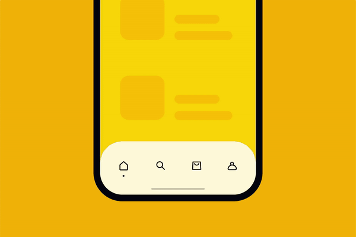

# MagicTabBar



# Installation
- Drag & drop source folder in your project directory.


# 1) Create TabItem Model like below that return [ViewController]

- TabItem model return Tab with Image, without Image & tabName

```swift
let v1 = HomeViewController(nibName: "HomeViewController", bundle: nil)
TabItem(v1, imageName: "home", selectedImage: nil, tabName: nil)

// v1 stands for ViewController
// pass image name as String
// pass selectedImage as UIImage
// pass tabName as String

func magicTab() -> [TabItem] {
  let v1 = HomeViewController(nibName: "HomeViewController", bundle: nil)

  let v2 = HomeViewController(nibName: "HomeViewController", bundle: nil)

  let v3 = HomeViewController(nibName: "HomeViewController", bundle: nil)

  let v4 = HomeViewController(nibName: "HomeViewController", bundle: nil)

  let v5 = HomeViewController(nibName: "HomeViewController", bundle: nil)

  let v6 = HomeViewController(nibName: "HomeViewController", bundle: nil)

  let v7 = HomeViewController(nibName: "HomeViewController", bundle: nil)

  let v8 = HomeViewController(nibName: "HomeViewController", bundle: nil)

  let v9 = HomeViewController(nibName: "HomeViewController", bundle: nil)

  let v10 = HomeViewController(nibName: "HomeViewController", bundle: nil)

  let v11 = HomeViewController(nibName: "HomeViewController", bundle: nil)

  let v12 = HomeViewController(nibName: "HomeViewController", bundle: nil)

  
  let t1 = TabItem(v1, imageName: "home", selectedImage: nil, tabName: nil)
  let t2 = TabItem(v2, imageName: "search", selectedImage: nil, tabName: nil)
  let t3 = TabItem(v3, imageName: "cart", selectedImage: nil, tabName: nil)
  let t4 = TabItem(v4, imageName: "profile", selectedImage: nil, tabName: nil)
  let t5 = TabItem(v5, imageName: "menu", selectedImage: nil, tabName: nil)
  let t6 = TabItem(v6, imageName: "discount", selectedImage: nil, tabName: nil)
  let t7 = TabItem(v7, imageName: "free", selectedImage: nil, tabName: nil)
  let t8 = TabItem(v8, imageName: "money", selectedImage: nil, tabName: nil)
  let t9 = TabItem(v9, imageName: "bag", selectedImage: nil, tabName: nil)
  let t10 = TabItem(v10, imageName: "payment", selectedImage: nil, tabName: nil)
  let t11 = TabItem(v11, imageName: "sale", selectedImage: nil, tabName: nil)
  let t12 = TabItem(v12, imageName: "car", selectedImage: nil, tabName: nil)
  return [t1,t2,t3,t4,t5,t6,t7,t8,t9,t10,t11,t12]
}
```

## 2) Set MagicTabBarViewController as rootViewController in didFinishLaunchingWithOptions

```swift
window = UIWindow(frame: UIScreen.main.bounds)
let tab = MagicTabBarViewController.init(nibName: "MagicTabBarViewController", bundle: nil, magicData: magicTab())
window?.rootViewController = tab
window?.makeKeyAndVisible()
```

# Now Boommmmm & Run. Your one star give me a lot inspiration.

- For More Info... Download Project and check all stuff configuration in AppDelegate


  <head>
    <meta name="google-site-verification" content="AvjjzvmdAdcv7qWwGVbIPEDZD_dbcF2KtvMx5ax4A4A" />
  </head>


<a href="https://www.paypal.com/cgi-bin/webscr?cmd=_xclick&business=XAYQKAT69SRME&lc=NZ&item_name=Buy%20me%20a%20coffee&amount=3%2e00&currency_code=USD&button_subtype=services&bn=PP%2dBuyNowBF%3abtn_buynowCC_LG%2egif%3aNonHosted" target="_blank"></a>
